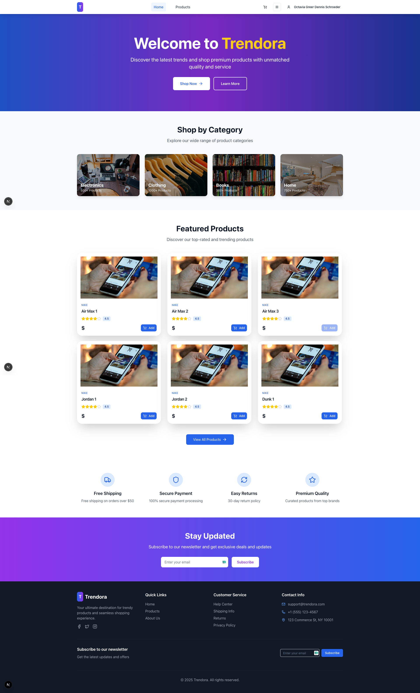
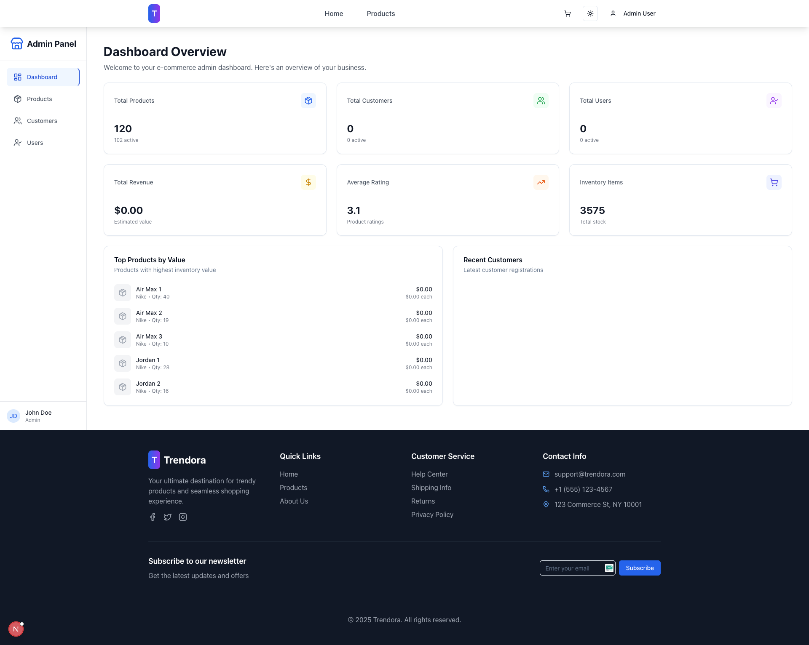
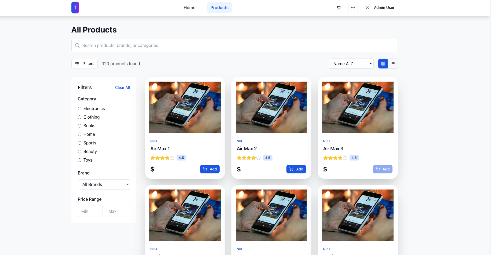
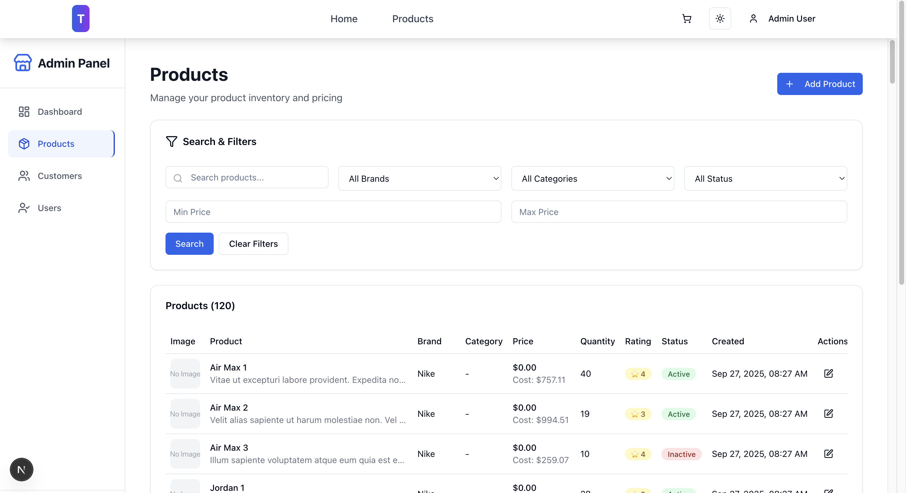
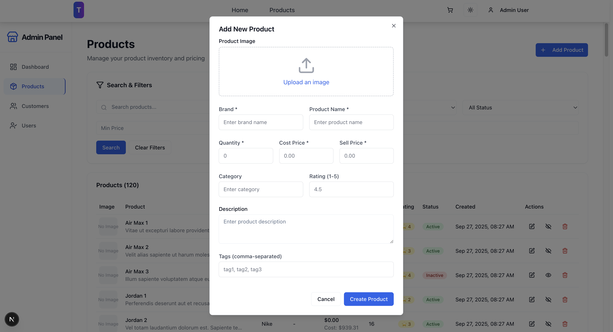
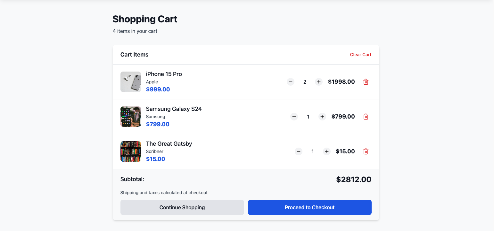
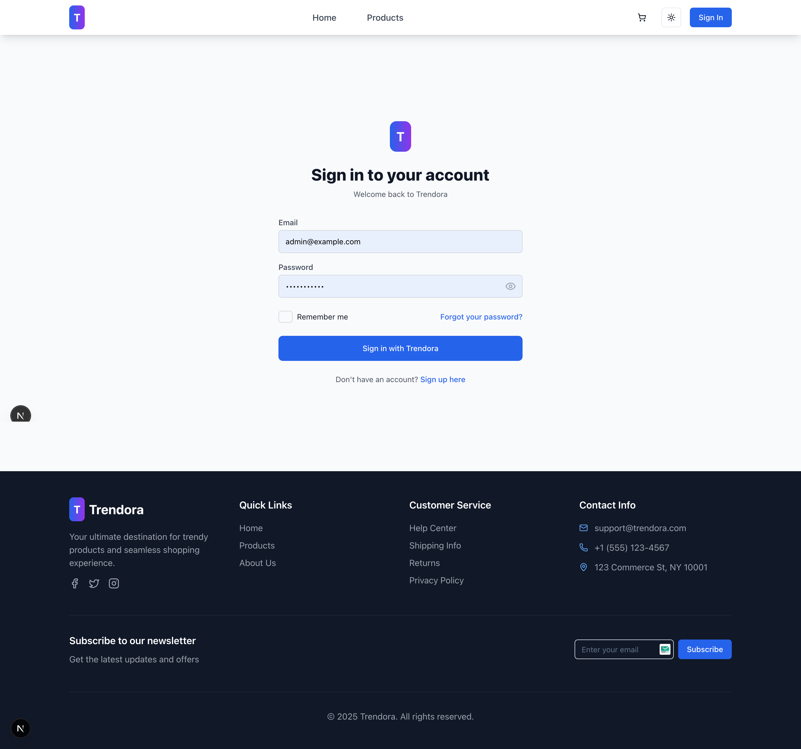
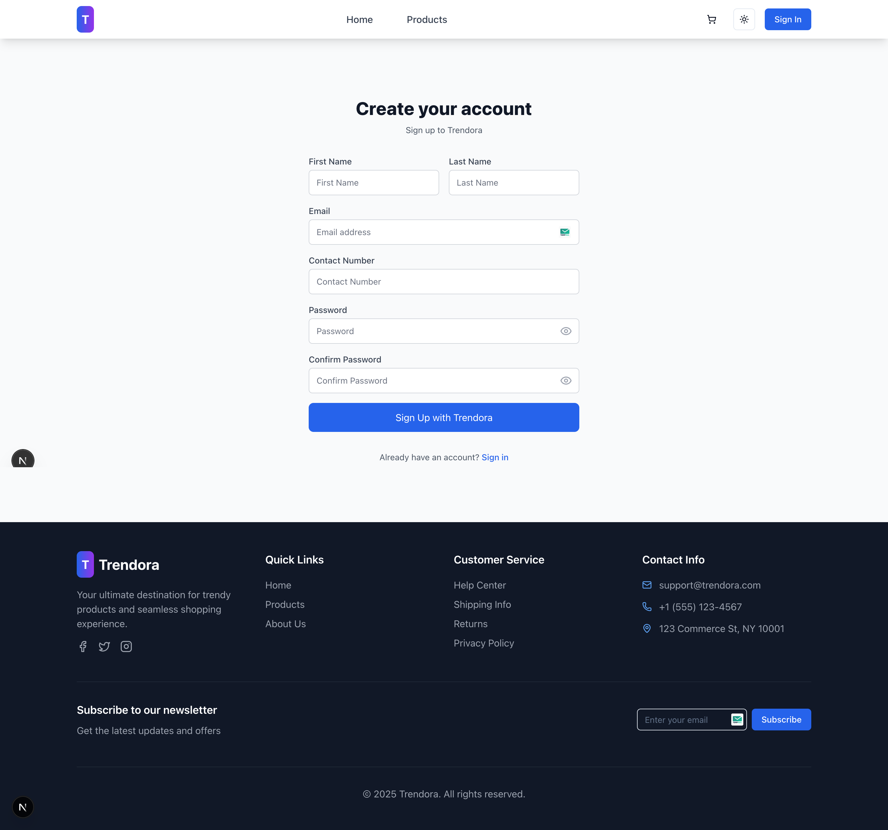

# Trendora

Modern e-commerce monorepo with a Laravel API backend and a Next.js (App Router) frontend. Implements authentication, role-based access control, product and user management, cart, and profile flows. API is documented in OpenAPI.

## Features
- **Authentication & RBAC**
  - JWT/Sanctum-based auth, role checks for `admin`, `user` (staff), and `customer`.
  - `AuthGuard` on frontend routes (dashboard protected for admin/staff; cart for customers).
- **Products**
  - CRUD with image upload, active toggle, pagination, filtering, and sorting.
  - Numeric validation for price, cost price, rating, and stock quantity.
- **Cart**
  - Customer-only cart: add, update quantity, remove, and clear.
- **Users & Customers (Admin)**
  - List, filter, activate/deactivate, delete.
  - Change role and toggle product privileges (create/update/delete).
- **Profile**
  - View/update profile for all authenticated users.
- **Home Page**
  - Featured products (max 6) fetched from API.
- **API Documentation**
  - OpenAPI spec at `docs/openapi.yaml`.

## Tech Stack
- **Frontend**: Next.js (App Router), TypeScript, RTK Query, Redux Persist, TailwindCSS, shadcn/ui, Zod
- **Backend**: Laravel (API), PHP, MySQL/PostgreSQL (configure via `.env`), Sanctum/JWT
- **Tooling**: OpenAPI (Swagger), ESLint, Prettier

## Monorepo Structure
```
trendora/
├─ backend/               # Laravel API
├─ frontend/              # Next.js frontend
└─ docs/
   └─ openapi.yaml        # API spec
```

## Prerequisites
- Node.js 18+
- npm or pnpm/yarn
- PHP 8.2+ and Composer
- MySQL/PostgreSQL (or compatible DB)

## Backend Setup (Laravel)
1. Copy env and configure DB/app keys:
   ```bash
   cd backend
   cp .env.example .env
   php artisan key:generate
   # Configure DB_* in .env
   ```
2. Install dependencies and migrate:
   ```bash
   composer install
   php artisan migrate
   # optional: php artisan db:seed
   ```
3. Storage link (if using image uploads):
   ```bash
   php artisan storage:link
   ```
4. Serve API (default in this project: http://localhost:8080):
   ```bash
   php artisan serve --host=127.0.0.1 --port=8080
   ```
5. Authentication
   - Using Sanctum/JWT. Ensure CORS and cookie/domain settings align with your frontend origin if using cookies.

## Frontend Setup (Next.js)
1. Create env file and point to your API:
   ```bash
   cd frontend
   cp .env.example .env.local
   # Set NEXT_PUBLIC_API_URL, e.g.
   # NEXT_PUBLIC_API_URL=http://localhost:8080/api
   ```
2. Install deps and run dev:
   ```bash
   npm install --legacy-peer-deps
   npm run dev
   # or: pnpm install && pnpm dev
   ```
3. Build for production:
   ```bash
   npm run build && npm run start
   ```

### Frontend Highlights
- Store configuration in `frontend/src/store/` with RTK Query API splits under `src/store/api/splits/`.
- Auth persistence via Redux Persist; provider wraps app in `src/provider/index.tsx`.
- Guards:
  - Dashboard (admin/staff): `src/app/(dashboard)/layout.tsx`
  - Cart (customer): `src/app/cart/page.tsx` uses guard on page
- Pages:
  - Profile: `src/app/profile/page.tsx`
  - All Products: `src/app/(dashboard)/all-products/page.tsx`
  - All Users: `src/app/(dashboard)/all-users/page.tsx`
  - All Customers: `src/app/(dashboard)/all-customers/page.tsx`

## Environment Variables
- Frontend
  - `NEXT_PUBLIC_API_URL` (required): Base API URL, e.g. `http://localhost:8080/api`
- Backend (Laravel)
  - `APP_URL`, `APP_KEY`
  - `DB_*` (connection, host, port, database, username, password)
  - Auth/CORS settings as needed

## API Documentation (Swagger)
- OpenAPI spec: `docs/openapi.yaml`
- View options:
  - Swagger Editor (online): Import the YAML.
  - Swagger UI locally (optional): host with your preferred tool or Laravel Swagger UI package.

## Screenshots (placeholders)
- 
- 
- 
- 
- 

- 
- 
- 
- 
- 
